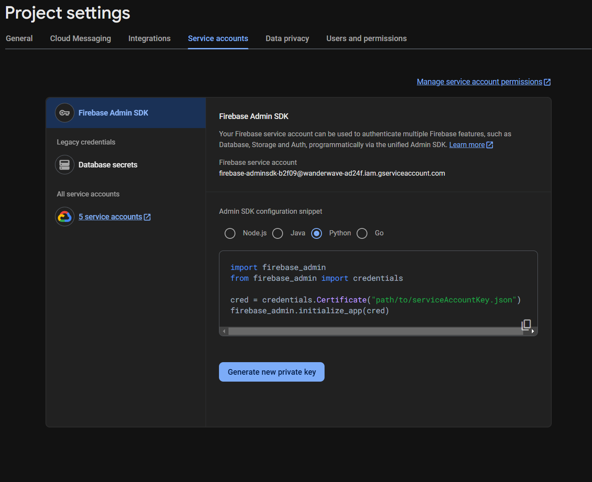

I’m developing a mobile app and needed an efficient way to import existing document data into Firestore. I created a script that accomplishes this task, making it particularly useful during the initial stages of app development. While this script is not optimized for handling large datasets, it effectively facilitates data import when building out the app's features.

Modify the script for your needs!

Go to Firebase Console:

Open Firebase Console and select your project.
Navigate to Project Settings:

Click on the gear icon next to Project Overview in the upper left.
Select Project settings from the dropdown menu.
Create a Service Account:

In Project settings, go to the Service accounts tab.
Click on the Generate new private key button. This will download a JSON file containing your service account credentials to your computer.
Save the JSON File:

Place this JSON file in a secure location, as it contains sensitive credentials. You will have to select this file when you run the script.

Have Fun!

